# Record Service

  Record Service is implemented as micro-service. This service is aimed to be self contained with production quality features like monitoring, infrastructure as code, profile based development/deployment, cloud deployable, pipleline etc. Following are the main tech stack used:
   1. Java 1.8.0_91
   2. Maven 3.5.0, Maven Docker plugin (io.fabric8 0.24.0)
   3. Spring 5.0.4.RELEASE
   4. Spring Boot 2.0.0.RELEASE
   5. Hazelcast 3.9.2
   6. EclipseLink 2.7.1 (ORM - JPA 2.2.0)
   7. Springfox 2.8.0 (Swagger integration)
   8. Lombok 1.16.16
   9. Stagemonitor 0.88.2 (APM - Application Performance Monitoring)
   10. Spring Cloud - 2.0.0.M7 (Consul 1.0.6 - Service Registry)
   11. Docker Community Edition Version 18.03.0-ce-mac58 (23607)
   12. RSQL 2.0.0 (Rest Query DSL)
   
 #### _**Instructions**_ To Setup Record Service

  1. To build the project and download its dependencies, use following command:
     ```
     maven clean install -DskipTests
     ```
     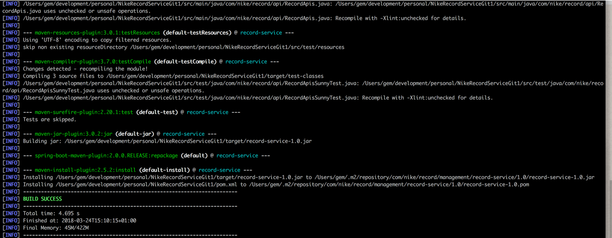
  2. Import the project into IDE of choice (IntelliJ, Eclipse etc). Record Service uses project Lombok, hence enable 
     annotation processor in the IDE of your choice. This will start Lombok annotation driven byte code generation.
     
     Lombok enable the byte code generation of boilerplate code, as shown below:
     
      ```java
         @AllArgsConstructor
         @NoArgsConstructor
         @EqualsAndHashCode(of = "id")
         @ToString
         @Builder(toBuilder = false, builderMethodName = "newRecord")
         @Getter
         @Setter
         @Cache
         @Slf4j
         public class Record {
           // ....
     
        }
      ```
     
  3. All the test can be run using command:
     ```
     mvn test
     ```
     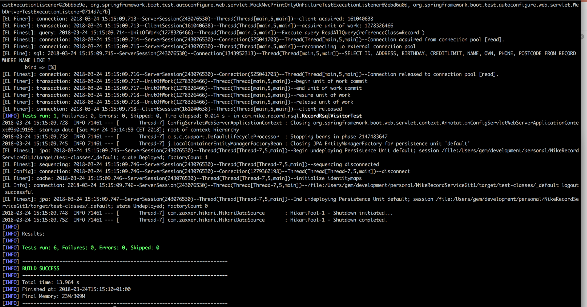
  
  4. Record service also contains centOS based docker image with service registry (consul). Use following command to build & run Record Service:
     ```
       mvn docker:build docker:run
     ```
     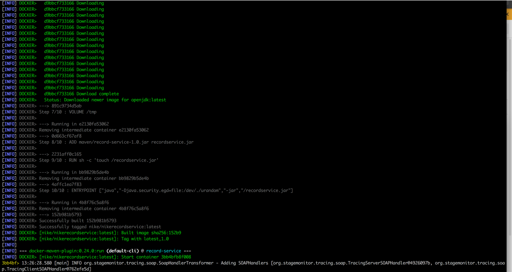
     
     Alternatively, following command can be used:
     ```
       docker-compose -f docker-compose src/main/docker/docker-compose.yml up
     ```
     
     Verify Record Service centOS image by SSH into it:
     ```
            docker exec -it [container name e.g. competent_gates] bash
      ```
      **_NOTE:- Service Registry URL: http://localhost:8500_**
       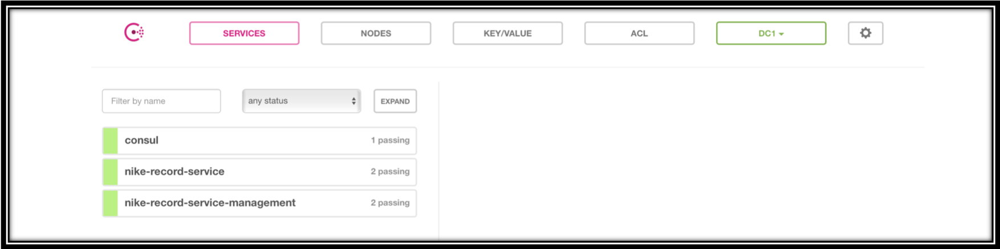
         
      _**NOTE!**_
      Following configuration (config/application.yml) is triggered for _Consul based service registration:
      
       ```yaml
      spring:
        profiles: consul
        cloud:
          consul:
            #host: '{{ service_hostname | default("malhotras-2.local") }}'
            host: ${myhostname}
            port: 8500
            discovery:
              health-check-path: /health
              instanceId: ${spring.application.name}:${random.value}
              prefer-ip-address: true
              health-check-interval: 10s
            config:
              enabled: true
              watch:
                enabled: true
              failFast: false
       ```
       
       It's worth noting here that, the **_host_** can be dynamically configured using Ansbile scripting or using BuilderDockerfile.groovy.
       As a result, there will not be any need to change "host", when running on different machine. But its worth mentioning that in consul, RecordService will be registered by ipaddress,as a consequence DHCP will be handled seamlessly and _no_need_to_change_ application configuration when moving from one environment to another. BuilderDockerfile.groovy is configured as maven goal in phase "prepare-package", hence whenever maven build is triggered "host" is resolved in config/application.yml 
     
  5. Running  Record Service
  ##### Run  Record Service without Consul (development environment)
  	
	java -jar target/record-service-1.0.jar --spring.profiles.active=default --spring.cloud.consul.enabled=false	
	
	
  ##### Run  Record Service with Consul (production like environment)
  
  As mentioned above, following command can be used to package,build & run  Record Service docker image:
  
  ```
  mvn package -DskipTests docker:build docker:run
  ```
  
  Now the docker images of Consul and RecordService is up,its time to hit the RecordService. All details of the  Record Service APIs can be accessed using following swagger URL:
     ```
     http://[localhost|ipAddress:hostName]:20011/swagger-ui.html
      ```
  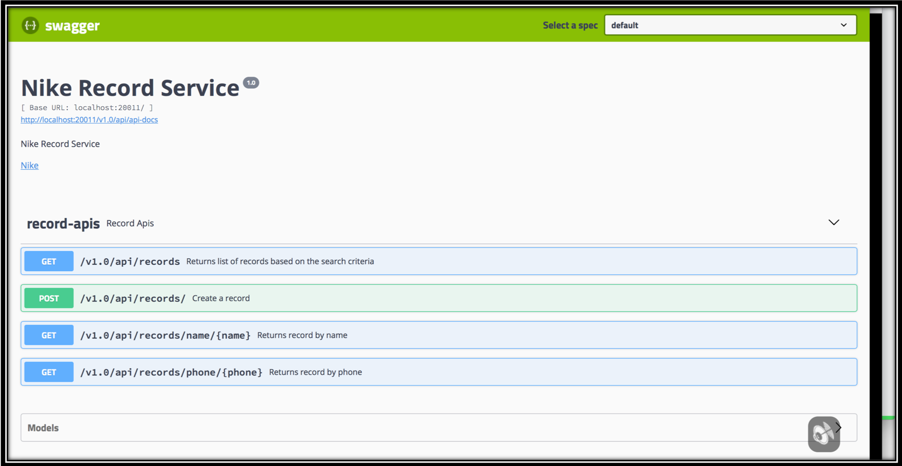   

     
   ####  Service Java Package Structure
Following picture shows the package structure of  Record Service:

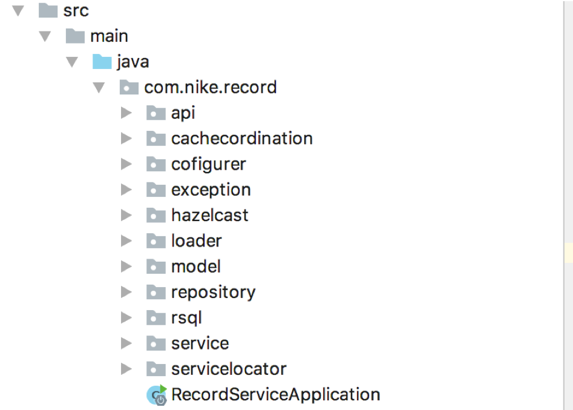
#### 1) "_com..record.api_" package contains REST resource/handler/controller.
#### 2) "_com..record.cachecordination_" package contains classes for JPA L2 cache handling in cluster
#### 3) "_com..record.configurer_" package contains all @Configuration classes
#### 4) "_com..record.exception_" package contains exception classes and controller advise.
#### 5) "_com..record.hazelcast_" package contains classes which integrates Hazelcast
#### 6) "_com..record.loader_" package contain a service which loads data from Workbook.csv into DB
#### 7) "_com..record.model_" package contains domain model
#### 8) "_com..record.repository_" contain a record repository class
#### 9) "_com..record.rsql_" contains classes which integrate with RSQL
#### 10)"_com..record.servicelocator_" contain a service locator class
   
   #### Spring Wiring & Application Configurability
   All the configurations of this service are externalized in the folder "/config" and not packaged inside "src/main/resources". As a result,  Record Service properties can be changed without rebuilding.It also uses spring profile for development ease. As a consequence a developer can work with in memory DB e.g. H2 using default profile, whereas, in production this service will work seamlessly with any other DB, by just changing profile (check application.yml file for more details).
   Refer to package: com..record.cofigurer for more details on configurability. Below are the main classes:
   1) BeanConfigurer
   2) EclipseLinkConfigurer
   3) SwaggerConfigurer
   
   #### ORM/JPA,Hazelcast
   This service uses JPA (EclipseLink) L2 cache (shared cache). L2 cache of JPA is local to JVM. This serivce uses Hazelcast's DurableExecutorService to co-ordinate JPA L2 cache i.e. keep the cache in sync. In case, there is any update/delete in the Record, RecordL2CacheCoordinationCommand command is relayed to nodes, which then invalidate's local JVM L2 cache.
  
   Following are the key Eclipse/JPA configurations worth mentioning added for high READ throughput performance optimizations:
  
    eclipselink.cache.shared.default: true
    eclipselink.jdbc.batch-writing: jdbc
    eclipselink.jdbc.batch-writing.size: 1000
    eclipselink.jdbc.cache-statements: true
    eclipselink.jdbc.cache-statements.size: 1000
    eclipselink.jdbc.bind-parameters: true
    eclipselink.cache-usage: CheckCacheThenDatabase
    
    NOTE: 
     At startup Record(s) are loaded from WorkBook.csv into DB. Batch write is configured to avoid multiple round trips to the DB for insert/update/delete in transaction. This will aide in faster startup.
      Begin batch statements
        INSERT INTO RECORD (ID, ADDRESS, BIRTHDAY, CREDITLIMIT, NAME, OVN, PHONE, POSTCODE) VALUES (?, ?, ?, ?, ?, ?, ?, ?)
	        bind => [6, Sint Jansstraat 32, 1980-08-10, 63.6, Friendly, User, 1, 0885-291029, 4220 EE]
          bind => [5, Vredenburg 21, 1978-11-09, 54.5, Gibson, Mal, 1, 06-48958986, 3209 DD]
	        bind => [1, Voorstraat 32, 1987-01-01, 10000.0, Johnson, John, 1, 020 3849381, 3122gg]
          ... ..... 
      End Batch Statements
   
   
   Hazelcast cluster can be setup by using following application.yml file property. The value of this property should be machine/ip address:portNumer separated by ",". If the value of this property is not specified, it will default to 127.0.0.1:5701
   
   ```
   spring:
     profiles: hazelcast
   record-service:
     cluster:
       members: {{ _services_cluster_members | default("127.0.0.1:5701") }}
   ```
   
   NOTE: Ansible scripting can be used to dynamically setup cluster members.
   
   Following are the classes which setup Hazelcast. These classes lives in the packge - com..record.hazelcast:
   1) RecordServiceHazelcastClusterProperty
   2) RecordServiceHazelcastConfigBuilder
   3) RecordServiceSpringConfiguration
   
    The above classes provides sugar DSL to integrated with Hazelcast (_NO_XML_HELL_) as shown below:
   
    
        @Bean
        public Config hazelCastConfig() {
    
    
            return newHazelcastConfigBuilderWith(clusterProperty.members).withBeanFactory(beanFactory).buildHazelcastConfig();
        }
    

#### Swagger Definition

  The swagger defintion can be obtained by hitting the below URL.
  ```
  http://[hostName|ipAddress|localhost]:20011/v2/api-docs
  ```
  
  ####  Record Service APIs URL - Context Root http://[hostName|ipAddress|localhost]:20011/v1.0/api
   
   1) GET multiple records with pagination: /v1.0/api/records?search=[Query DSL]&page=[pageNumber]&size=[sizeOfPage]
   
   2) GET single record by name: /v1.0/api/rcords/name/{name}
   
   3) GET single record by phone: /v1.0/api/records/phone/{phone}
   
   The class RecordApis implements above APIs.
   
##  Record Service Querying 
   
For querying support  Record Service uses [RSQL](https://github.com/jirutka/rsql-parser) (refer to package com..record.rsql). This framework provides query based DSL. For querying multiple records, this DSL can be passed as a query parameter - "search".RSQL is integrated using following classes:

1) RecordRsqlVisitor
2) RsqlBuilder
3) RsqlSearchOperation
4) RsqlSpecification

```
Node rootNode = new RSQLParser().parse(search);
Specification<Record> spec = rootNode.accept(new RecordRsqlVisitor<Record>());
```
RecordRsqlVisitor using visitor pattern gives org.springframework.data.jpa.domain.Specification, which is then consumped with Spring Data based repository method.

   #### Query Operators
   
       a) Equal to: ==

       b) Not equal to: !=

       c) Less than: =lt= or <

       d) Less than or equal to: =le= or ⇐

       e) Greater than operator: =gt= or >

       f) Greater than or equal to: =ge= or >=

       g) In: =in=

       h) Not in: =out=
   
   #### Query Logical operators
   
       a) Logical AND: ; or and

       b) Logical OR: , or or
      
  ### Examples  Record Service
  
      a) GET all records:  /v1.0/api/records?search=name==* 

      b) GET all records whose creditLimit is greater than 9999: /v1.0/api/records?search=creditLimit>9999
      
      c) GET single record by name peter: /v1.0/api/records/name/peter
      
      d) GET single record by phone: /v1.0/api/records/phone/06373733
   


  ### APM - StageMonitor
  This service also provide self monitoring capabilities using open source APM framework - [stagemonitor](http://www.stagemonitor.org).
  No java agent is required to be configured. When  Record Service starts, it automatically kicks in, as shown in the swagger UI below:
  
  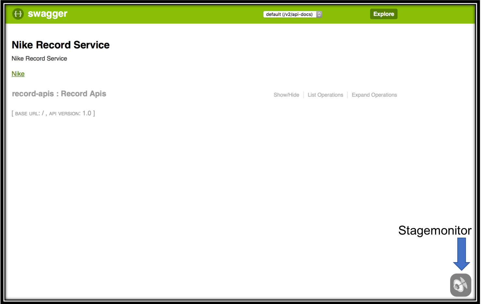
  
  Following picture shows the detailed call trace monitoring of the REST call: GET all records:
  
  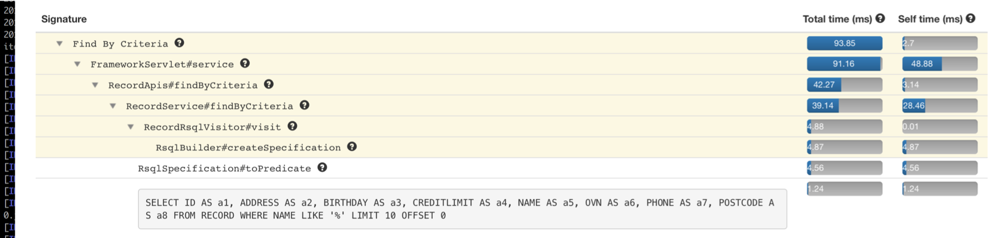
  
  **JDBC monitoring**
  
  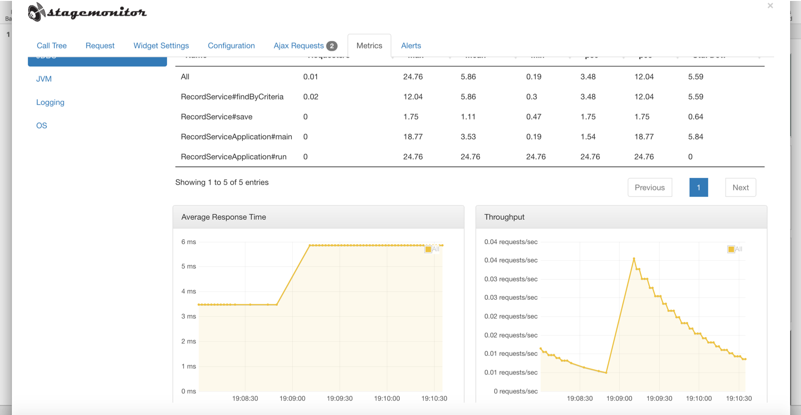
  
  _**NOTE:**_ StageMonitor also provides ability to gather KPIs using annotation @SLA, @Metered etc
  
   Following code snippet shows integration with stage monitor:
   
   ```
   @SpringBootApplication
   @EnableAutoConfiguration
   public class RecordServiceApplication implements CommandLineRunner {
   
       @Autowired
       private RecordDataLoader loader;
   
       public static void main(String[] args) {
           Stagemonitor.init();
           SpringApplication.run(RecordServiceApplication.class, args);
       }
       .......
       .......
   ```
  
  ### RecordService Jenkins Pipeline
  
  Following is the Jenkins pipeline for RecordService:
  
  ```groovy
  pipeline {
    // Java8
    agent { label "" }

    stages {
        stage('build') {
            steps {
                script {

                    git branch: 'master', credentialsId: '21b2ff64-0488-4867-828f-6b40133f863e', url: 'git@github.com:NDE-Europe/gaurav-exercise.git'
                }
            }

        }
        stage('Integration tests') {
            // Run the maven build
            steps {
                script {
                    def jdk8 = tool 'jdk 1.8.0_91'

                    env.JAVA_HOME = "${jdk8}"

                    echo "jdk installation path is: ${jdk8}"

                    sh "${jdk8}/bin/java -version"

                    sh '$JAVA_HOME/bin/java -version'

                    def mvnHome = tool 'maven 3.5.0'
                    if (isUnix()) {
                        sh "'${mvnHome}/bin/mvn'  clean install"
                    } else {
                        bat(/"${mvnHome}\bin\mvn" clean install/)
                    }

                }
            }
        }
    }

}
  ```
  
   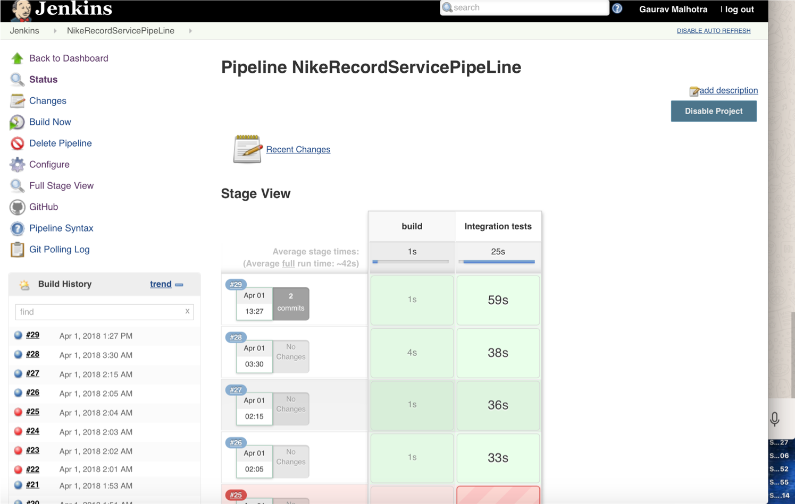
    
 ### RecodService Portainer.io
 
 Swarm can be enabled using following command:
 ```
    swarm init
 ```
 
 When swarm is up, RecordService scaling can be tested using [portainer.io](https://portainer.io). This framework 
 also provide production quality docker monitoring. Use following
 command to start portainer docker service:
 
  ```
    ## Create portainer service in docker swarm on port 80
    docker service create \
    --name portainer \
    --publish 80:9000 \
    --constraint 'node.role == manager' \
    --mount type=bind,src=/var/run/docker.sock,dst=/var/run/docker.sock \
    portainer/portainer \
    -H unix:///var/run/docker.sock
  ```
 
 Use following URL to access portainer UI:
 
 ```
    http://localhost:80
 ```
 
 
 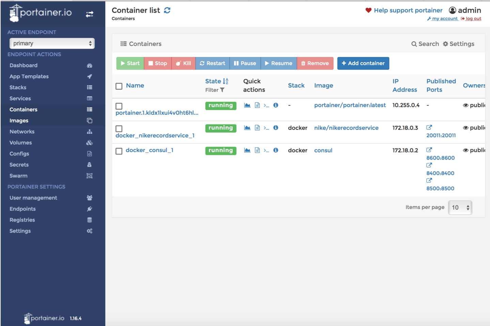
 
  ### Deploy RecordService to AWS cloud
  
  To manually deploy RecordService on Amazon ECS, Amazon [ECS command-line client](https://github.com/aws/amazon-ecs-cli)
  will be used:
  1. Configure the ECS client with Amazon credentials
  2. Select the region the client is going to work in - eu-central-1
  3. Define the default ECS cluster - -dev the ECS client will be working against
  4. This work is done by running the ecs-cli configure command:
   ```
  	ecs-cli configure --region eu-central-1 \
                          --access-key $AWS_ACCESS_KEY \
                          --secret-key $AWS_SECRET_KEY \
                          --cluster -dev
  ```
  
  The ecs-cli configure command will set the region where the cluster is located, 
  also Amazon access and secret key, and the name of the cluster (-dev) to deploy. 
  
  NOTE: 
  1. environment variables ($AWS_ACCESS_KEY and $AWS_SECRET_KEY) holds Amazon access
     and secret key.
  	  
  To do the deployment, issue the following command:
  
   ```
      ecs-cli compose --file src/main/docker/docker-compose.yml up
   ```
          
  Verify running of RecordSerice by using following command:
  
  ```
  ecs-cli ps
  ```
  
  ```
  NOTE: ecl-cli suports yaml version 2.0. Hence, a manual change is required to docker-compose.yml, i.e. update version to 2.0
  ```


   
